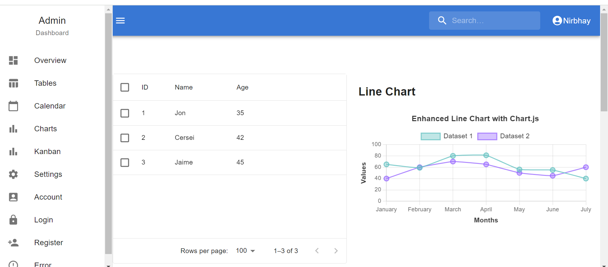
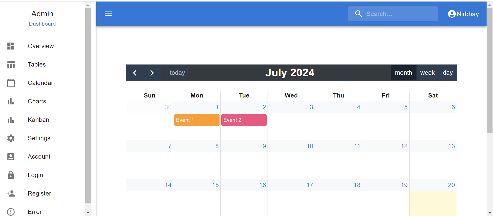
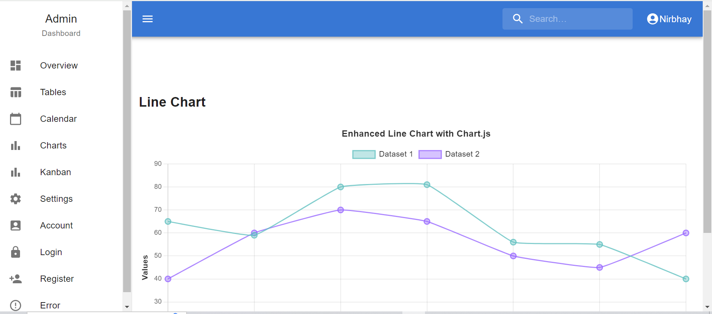

# Customizable Admin Dashboard

## Overview

Welcome to the Customizable Admin Dashboard! This project provides a powerful and flexible admin interface that includes dynamic themes, interactive charts, tables, a calendar, and a Kanban board. Perfect for efficient data management and visualization.

### Screenshots
## 1.Home Page 
 

## 2.Calendar Page 
 

## 3.Tables Page 
 

## Features

- 🎨 **Dynamic Themes**: Easily switch between light and dark modes.
- 📊 **Interactive Charts**: Visualize data with customizable charts.
- 📅 **Calendar Integration**: Manage events and schedules seamlessly.
- 📝 **Kanban Board**: Organize tasks with a draggable Kanban board.
- 📋 **Data Tables**: Display and manage data efficiently.
- 🔄 **Seamless Integration**: Smooth user experience with easy navigation.

## Usage

- **Access the Application**: Open your browser and navigate to http://localhost:3000.
- **Explore Features**: Use the sidebar to navigate between different sections such as Dashboard, Settings, Ecommerce, Orders, Employees, and Customers.
- **Customize Themes**: Use the theme toggle button to switch between light and dark modes or customize the theme according to your preference.
- **Interact with Components**: Utilize interactive tables, charts, calendars, and the Kanban board to manage data, track tasks, and view analytics.

## Future Improvements

- 🔒 **Enhanced Security**: Implement user authentication and authorization to secure access to various dashboard features and user data.
- 🌐 **Multi-Language Support**: Add support for multiple languages to accommodate users from different regions.
- 📲 **Mobile Responsiveness**: Optimize the dashboard for mobile devices to ensure a seamless experience on smaller screens.
- 📈 **Advanced Analytics**: Introduce more advanced analytics features, such as custom report generation and detailed data insights.
- 🔄 **Real-Time Data Updates**: Integrate real-time data updates and notifications for a more dynamic user experience.

- 
### Contact
For any questions or feedback, please open an issue on the repository or contact the project maintainer.

---

 Happy Coding! 🎉

